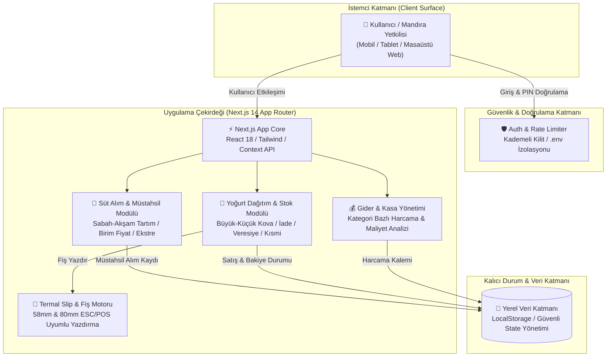

<div align="center">

# 🥛 Bademcioğlu Süt ve Süt Ürünleri
### Mandıra, Süt Alımı, Yoğurt Üretim-Dağıtım ve Kasa Takip Sistemi

[](https://nextjs.org/)
[](https://react.dev/)
[](https://www.typescriptlang.org/)
[](https://tailwindcss.com/)
[](https://playwright.dev/)
[](https://vercel.com/)

<p align="center">
  <b>Mersin Anamur'un yerli markası Bademcioğlu Yoğurtları</b> için özel olarak geliştirilmiş modern, hızlı, güvenli ve çift temalı mandıra yönetim otomasyonu.
</p>

---

</div>

## 📌 İçindekiler
- [Mimari Genel Bakış (Archify Architecture)](#-mimari-genel-bakış-archify-architecture)
- [Temel Modüller ve Özellikler](#-temel-modüller-ve-özellikler)
- [Güvenlik & Brute-Force Koruması](#-güvenlik--brute-force-koruması)
- [Teknoloji Yığını](#-teknoloji-yığını)
- [Kurulum & Çalıştırma](#-kurulum--çalıştırma)
- [Vercel Canlıya Dağıtım](#-vercel-canlıya-dağıtım)
- [Test ve Doğrulama](#-test-ve-doğrulama)
- [Lisans](#-lisans)

---

## 🏛️ Mimari Genel Bakış (Archify Architecture)

Sistemin bileşen yapısı, veri akışları ve güvenlik sınırları **Archify** derleme motoru ile modellenmiş ve doğrulanmıştır.

> **Etkileşimli Archify Mimari Raporu:** [`docs/architecture/bademcioglu-architecture.html`](docs/architecture/bademcioglu-architecture.html)  
> **Archify JSON Şeması:** [`docs/architecture/bademcioglu.architecture.json`](docs/architecture/bademcioglu.architecture.json)



### 🧩 Archify Bileşen Matrisi

| Bileşen | Tip | Sorumluluk |
| :--- | :--- | :--- |
| **Kullanıcı / Yetkili** | External | Mobil ve masaüstü tarayıcılardan mandıra operasyonlarının yönetimi. |
| **Auth & Güvenlik Motoru** | Security | Kademeli üstel bekleme süreli (Exponential Backoff) Brute-Force koruması ve `.env` doğrulama. |
| **Süt Alım & Müstahsil** | Backend/Logic | Müstahsil kayıtları, sabah/akşam tartım cetveli, dinamik litre fiyatı ve dönemlik hesap dökümü. |
| **Yoğurt Dağıtım & Stok** | Backend/Logic | Büyük kova (3 kg) ve Küçük kova (1.5 kg) sipariş teslimi, boş kova ve bozuk yoğurt mahsuplaşması. |
| **Gider & Kasa Takibi** | Backend/Logic | Yem, ambalaj, yakıt, elektrik gibi mandıra giderlerinin kategori bazında kayıt ve analizi. |
| **Termal Fiş Motoru** | Service | Müşteriye teslim anında tek tıkla 58mm veya 80mm termal slip/fiş yazdırma. |
| **Yerel Veri Katmanı** | Database | İnternetsiz veya zayıf ağlarda dahi kesintisiz çalışan yerel veri mimarisi. |

---

## ✨ Temel Modüller ve Özellikler

### 1. 🥛 Süt Alım & Müstahsil Modülü
- **Sabah & Akşam Tartım Kaydı:** Günlük süt teslimatlarının litre bazında hassas kaydı.
- **Dinamik Fiyatlandırma:** Müstahsile göre veya genel litre birim fiyatı çarpanı ile anlık hak ediş hesabı.
- **Müstahsil Cari Ekstresi:** Geçmiş teslimatlar, yapılan ödemeler ve kalan bakiye dökümü.

### 2. 🥣 Yoğurt Dağıtım, Stok ve Veresiye Takibi
- **Ürün Çeşitleri:** Büyük Kova (3 kg) ve Küçük Kova (1.5 kg) yoğurt teslimat yönetimi.
- **İade & Zayiat Mahsubu:** Boş kova iadesi ve bozuk yoğurt bedellerinin toplam tutardan otomatik düşülmesi (negatif bakiye engeli).
- **Esnek Ödeme Yöntemleri:** Peşin ödeme, kısmi ödeme (kalan tutarı otomatik borç kaydetme) ve açık veresiye desteği.
- **Otomatik Bakiye Kapatma:** Eski kayıtlardan tahsilat yapıldığında veresiye listesinden borcun otomatik düşürülmesi.
- **Günlük Üretim & Stok Dengesi:** Günlük üretilen kova sayısı, dağıtılan adet ve zayiat arasındaki kalan stok denge hesabı.

### 3. 🧾 Termal Fiş & Slip Yazdırma Motoru
- **ESC/POS Uyumlu:** Masaüstü ve mobil bluetooth termal yazıcılarla doğrudan uyumlu slip tasarımı.
- **Akıllı Satır Gösterimi:** Sadece girilen ürün ve iadeler fişte listelenir; sıfır olan alanlar fişte yer kaplamaz.
- **Kurumsal İbareler:** Bademcioğlu Yoğurtları logosu, müşteri adı, tarih ve teslimat dökümü.

### 4. 💰 Gider & Kasa Yönetimi
- **Dinamik Kategori Ekleme:** Ambalaj, kova alımı, yem, akaryakıt, bakım-onarım vb. özel kategori tanımlama.
- **Tarihsel Filtreleme & Özet:** Günlük ve aylık toplam harcama dökümleri.

### 5. 🌓 Kusursuz Çift Tema (Dark & Light Mode)
- **Koyu Obsidian Tema (`#101726`):** Gece ve mandıra ortamlarında göz yormayan derin karanlık arayüz.
- **Aydınlık Beyaz Tema:** Yüksek kontrastlı, net ve ferah gündüz görünümü.
- Sayfa yenilense dahi kullanıcının tema tercihi korunur.

### 6. 📱 %100 Mobil Uyumlu (Responsive Design)
- **Mobil Alt Gezinme Çubuğu (Bottom Navigation Bar):** Tek elle kolay kullanım.
- **Açılır Süt Menüsü (Bottom Sheet):** Süt başlığı altındaki tartım, üretici ve döküm sekmelerine hızlı erişim.
- Sıfır yatay taşma (`overflow-x: hidden`), dokunmatik optimizasyonlu butonlar.

---

## 🛡️ Güvenlik & Brute-Force Koruması

Sistem kaba kuvvet saldırılarına karşı çok katmanlı güvenlik önlemleri ile korunmaktadır:

```
Hatalı Giriş 1-2 ──> ⚠️ Kalan Deneme Hakkı Uyarısı (Toast)
Hatalı Giriş 3   ──> ⛔ 30 Saniye Kilit (Girişler Dondurulur)
Hatalı Giriş 4   ──> ⛔ 60 Saniye (1 Dakika) Kilit
Hatalı Giriş 5   ──> ⛔ 300 Saniye (5 Dakika) Kilit
Hatalı Giriş 6+  ──> ⛔ 900 Saniye (15 Dakika) Maksimum Güvenlik Kilidi
```

- **Sıfır Kod İçi Şifre:** Kullanıcı adı ve şifre kod içinde kesinlikle tutulmaz; tamamen `.env` ortam değişkenlerine bağlıdır.
- **Yapay Güvenlik Gecikmesi (Timing Jitter):** Botların hızlı istek göndermesini engellemek için her doğrulamaya 300ms kontrollü gecikme uygulanır.
- **Zarif UI Kilidi:** Kilit durumunda buton üzerinde saniye geri sayımı gösterilir ve form kilitlenir.

---

## 💻 Teknoloji Yığını

| Alan | Teknoloji |
| :--- | :--- |
| **Framework** | [Next.js 14](https://nextjs.org/) (App Router) |
| **Arayüz Kütüphanesi** | [React 18](https://react.dev/) |
| **Tip Güvenliği** | [TypeScript 5](https://www.typescriptlang.org/) |
| **Stil & Tasarım** | [Tailwind CSS 3](https://tailwindcss.com/) + CSS Değişkenleri |
| **İkon Seti** | [Lucide React](https://lucide.dev/) |
| **E2E Test Paketi** | [Playwright Test](https://playwright.dev/) |
| **Mimari Modelleme** | [Archify](https://github.com/tt-a1i/archify) |
| **Dağıtım Platformu** | [Vercel](https://vercel.com/) |

---

## 🚀 Kurulum & Çalıştırma

### 1. Gereksinimler
- Node.js 18.x veya üzeri
- npm, yarn veya pnpm

### 2. Projeyi Klonlayın ve Bağımlılıkları Yükleyin
```bash
git clone https://github.com/kullanici_adiniz/sut-yogurt-takip-sistemi.git
cd sut-yogurt-takip-sistemi
npm install
```

### 3. Ortam Değişkenlerini Tanımlayın
Proje kök dizininde `.env.local` dosyası oluşturun ve giriş bilgilerinizi belirleyin:
```env
NEXT_PUBLIC_ADMIN_USERNAME=bademcioglu_yonetim
NEXT_PUBLIC_ADMIN_PIN=Bademcioglu.33*Mandira!
```

### 4. Geliştirici Sunucusunu Başlatın
```bash
npm run dev
```
Tarayıcınızda [http://localhost:3000](http://localhost:3000) adresine gidin.

---

## ☁️ Vercel Canlıya Dağıtım

1. Projenizi GitHub reponuza push edin.
2. [Vercel Dashboard](https://vercel.com/dashboard) üzerinden projeyi içe aktarın (`Import`).
3. **Settings ➡️ Environment Variables** sekmesine gidin ve şu iki anahtarı ekleyin:
   - `NEXT_PUBLIC_ADMIN_USERNAME` = `(Kendi belirleyeceğiniz kullanıcı adı)`
   - `NEXT_PUBLIC_ADMIN_PIN` = `(Kendi belirleyeceğiniz güçlü şifre)`
4. **Deploy** butonuna basarak canlıya çıkın!

---

## 🧪 Test ve Doğrulama

Tüm kritik iş kuralları, edge-case senaryoları, mobil düzen ve güvenlik kilitleri Playwright ile uçtan uca (E2E) test edilmektedir:

```bash
# Uçtan uca testleri çalıştırın
npx playwright test

# TypeScript tip kontrolü
npx tsc --noEmit
```

### Test Edilen Başlıca Senaryolar:
1. Boş adetlerle sipariş kaydını engelleme
2. Negatif sipariş tutarı engeli (iade mahsubu kontrolü)
3. Kısmi ödemede kalan bakiyenin veresiye borcuna dönüştürülmesi
4. Eski kayıttan ödeme yapılınca veresiyeden otomatik silinme
5. ESC/POS termal fiş satır filtreleme kontrolü
6. Dinamik gider kategorisi ekleme ve harcama kaydı
7. Toplam Yoğurt üretim, dağıtım ve zayiat stok denge hesabı
8. Şirket logosu ve güvenli giriş doğrulama
9. Çift tema (Koyu / Aydınlık) geçişi ve kalıcılık
10. Kademeli Brute-Force güvenlik kilidi ve üstel bekleme süresi
11. Mobil görünümde hamburger menü, alt gezinme çubuğu ve açılır alt menü testleri

---

## 📄 Lisans

Bu proje **Bademcioğlu Süt ve Süt Ürünleri** için geliştirilmiştir. Tüm hakları saklıdır.  
© 2026 Bademcioğlu Yoğurtları • Sağlık Mah. Anamur / MERSİN
